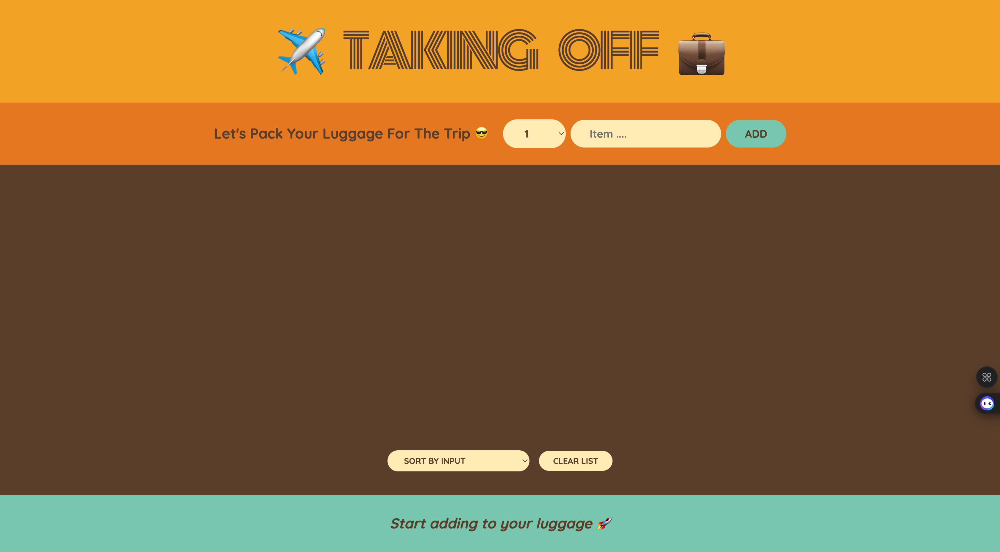
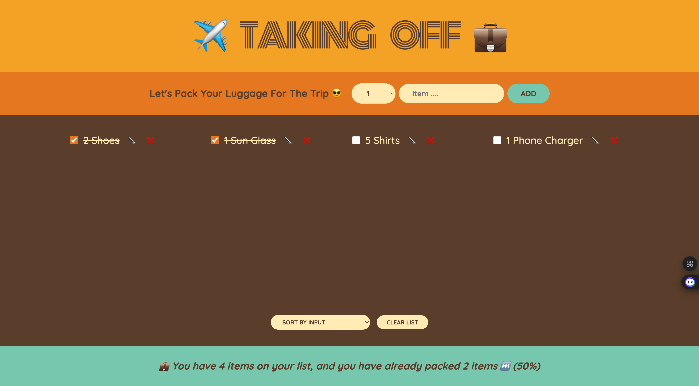
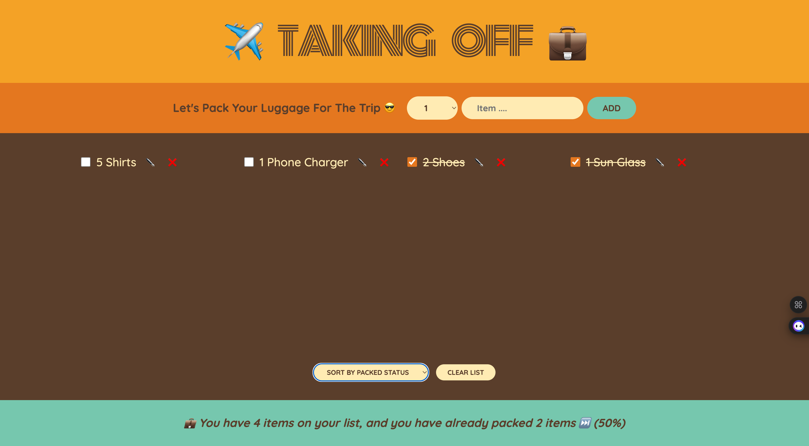

# Travel List.
"This is a simple application that helps the  user organize their travel luggages by adding every needed items in a check list and have them sorted based on status..
"








## Built With

- JSX, Css,JavaScript, React,React Hooks
- Visual Studio, Git, & GitHub;


## Getting Started

To run this project, you only need a computer with a browser (like Google Chrome, Mozilla Firefox, Microsoft Edge, Apple Safari, etc.) installed, and follow these steps:

1. In your terminal, in the folder of your preference, type the following bash command to clone this repository:

```sh
git@github.com:fortuneonyeka/travel-list.git
```

2. Now that you have already cloned the repo run the following commands to get the project up and running:
```sh
cd travel-list
npm install
npm start
```

3.  You can start adding, editing, completing and  deleting items as needed.

4.  All the changes will be automatically updated on your local server on http://localhost:3000/. You can stop your local server at any time hitting `<Ctrl> + C` on your keyboard.


## Author

👤 **Ihedoro Fortunatus O**

- GitHub: [@fortuneonyeka](https://github.com/fortuneonyeka)
- Twitter: [@onyekafortune](https://twitter.com/onyekafortune)
- LinkedIn: [Ihedoro Fortunatus](https://www.linkedin.com/in/fortunatus-ihedoro/)

## 🤝 Contributing

Contributions, issues, and feature requests are welcome!

## Show your support

Give a ⭐️ if you like this project!